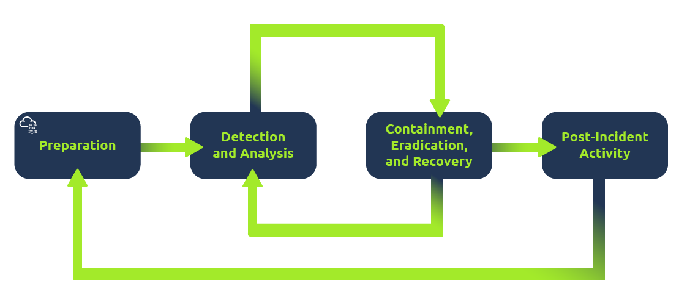

# Offensive Security Intro (Red Team):
https://github.com/OJ/gobuster can brute force websites to find hidden directories and pages using a given wordlist

# Defensive Security Intro (Blue Team):
There are many open-source databases out there, like AbuseIPDB, and Cisco Talos Intelligence, where you can perform a reputation and location check for the IP address.

### Security Operations Centre (SOC)
Team that monitors the network and its systems to detect maliious cybersec events. Main areas are e.g. 

Trends & vulnerability awareness
Policy violations
Unauthorised & illegal activity
Intrusion & breach detection

### Digital Forensics 
Is the application of traditional forensic science processes to digital devices. E.g. 

File system
System memory
System logs 
Network logs

### Incident Response 
Is how organisations manage security events such as breaches, data leaks and cyber attacks. This is to minimse damage, contain the threat and recover fast. The process will look like so:

# Search Skills:
Snake Oil is also a term in cybersec

ss (socket statistics) is replacing netstat in Linux

### Useful search engine filters
For google:
Use "exact phrase" to search for exact phrase
Use site: to search for results in specific site i.e. site:reddit.com cybersec
Use -, the minus sign to omit search results containing a particular word/phrase
Use filetype: to find for files instead of pages, such as PDF, DOC, XLS and PPT i.e. filetype:pdf [your favourite book]

### Specialized search engines
https://www.shodan.io/, a search engine for devices connected to the internet

https://search.censys.io/ appears similar to Shodan. However, Shodan focuses on Internet-connected devices and systems, such as servers, routers, webcams, and IoT devices. Censys, on the other hand, focuses on Internet-connected hosts. websites, certificates, and other Internet assets.

https://www.virustotal.com/c is an online website that provides a virus-scanning service for files using multiple antivirus engines.

https://haveibeenpwned.com/ (HIBP) does one thing; it tells you if an email address has appeared in a leaked data breach.

### Vulnerabilities and Exploits 
#### CVE
Common Vulnerabilities and Exposures (CVE) program can be thought of as a dictionary of vulnerabilities. It provides an id for vulnerabilities and security issues in software and hardware products. Each vulnerability is assigned a CVE ID with a standardized format like CVE-2024-29988. This unique id (CVE ID) ensures that everyone from security researchers IT professionals is referring to the same vulnerability, in this case CVE-2024-29988.

The MITRE Corp. maintains the CVE system. For more info and to search for CVEs, visit the https://www.cve.org/ website or the alternative https://nvd.nist.gov/ website.

#### Exploit Database

https://www.exploit-db.com/ is the Exploit Database which lists exploit codes from various authors; some of these exploit codes are tested and marked as verified.

GitHub can contain many tools related to CVEs, along with proof-of-concent (PoC) and exploit codes. E.g. searching for CVEs can give results that are related to the CVE.

### Technical Documentation

#### Linux Manual Pages

Using the command 'man' is actually op if you want to learn. With this command you can check the manual page for essentially all commands. E.g. issuing man ip will give you the manual for the command ip.

#### Microsoft Windows

Microsoft provides an official technical documentation page for its products via https://learn.microsoft.com/. 

#### Product Documentation 

Every popular product is expected to have well-organized documentation. Examples include: 
https://www.snort.org/documents
https://httpd.apache.org/docs/
https://nodejs.org/docs/latest/api/

Linux command cat stands for concatenate

#### Social Media

Social Media in cybersec pros:
- Allows you to connect with people and stay updated with cybersec professionals and companies

Social Media in cybersec cons:
- Your social media might give away answer to secret questions E.g. "which school did you go to as a child?"
- Social media can be used for social engineering attacks

