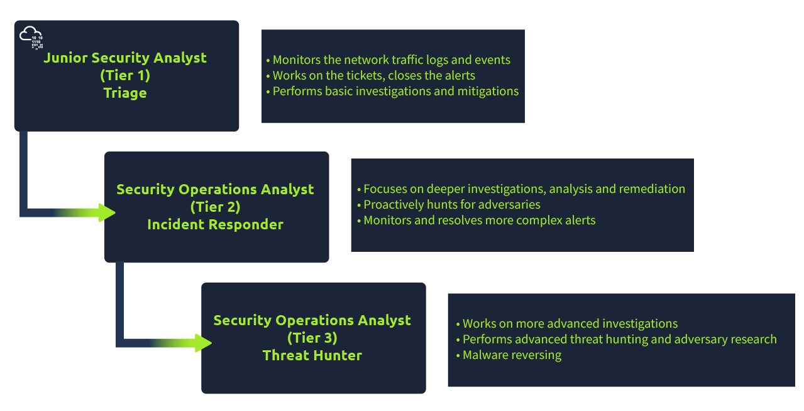
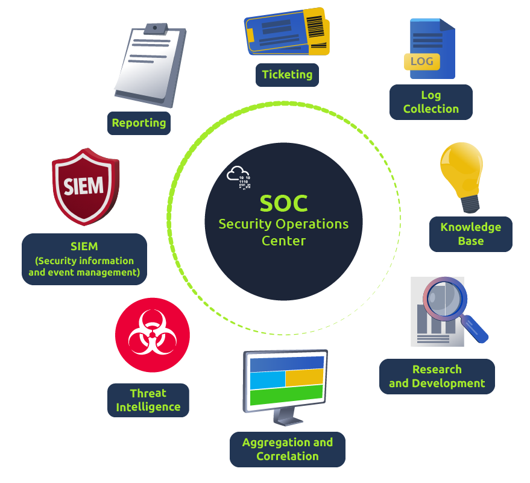

# Junior Security Analyst Intro
In the JSA role, you will be a Triage specialist, triaging or monitoring the event logs and alerts.

Desired certification is: the [CompTIA Security+](https://www.comptia.org/certifications/security)

Below is an overview of the SOC three-tier model:

https://www.trellix.com/security-awareness/operations/what-is-soc/ states their definition of a SOC: "Security operations teams are charged with monitoring and protecting many assets. These include intellectual property, personnel data, business systems, and brand integrity"

Below is an overview of the responsibilities of the SOC:

Prevention methods against attacks include  gathering intelligence data on the latest threats, threat actors, and their [TTPs](https://www.optiv.com/explore-optiv-insights/blog/tactics-techniques-and-procedures-ttps-within-cyber-threat-intelligence) (Tactics, Techniques, and Procedures). Also includes maintenance procedures like updating the firewall signatures and more.

A SOC team uses [SIEM](https://www.fireeye.com/products/helix/what-is-siem-and-how-does-it-work.html) (Security information and event management) and [EDR](https://www.mcafee.com/enterprise/en-us/security-awareness/endpoint/what-is-endpoint-detection-and-response.html) (Endpoint Detection and Response) tools to monitor suspicious and malicious network activities.

Imagine being a firefighter and having a multi-alarm fire - one-alarm fires, two-alarm fires, three-alarm fires; the categories classify the seriousness of the fire, which is a threat in our case. As a Security Analyst, you will learn how to prioritise the alerts based on their level: Low, Medium, High, and Critical.

# Pyramid Of Pain
This well-renowned concept is being applied to cybersecurity solutions like Cisco Security, SentinelOne, and SOCRadar to improve the effectiveness of CTI (Cyber Threat Intelligence), threat hunting, and incident response exercises.

### Hash Values (Trivial)

Various online tools can be used to do hash lookups like VirusTotal and Metadefender Cloud - OPSWAT.

It is really easy to spot a malicious file if we have the hash in our arsenal.  However, as an attacker, modifying a file by even a single bit is trivial, which would produce a different hash value. With so many variations and instances of known malware or ransomware, threat hunting using file hashes as the IOC (Indicators of Compromise) can become difficult.

### IP Address (Easy)

From a defense standpoint, knowledge of the IP addresses an adversary uses can be valuable. A common defense tactic is to block, drop, or deny inbound requests from IP addresses on your parameter or external firewall. This tactic is often not bulletproof as it’s trivial for an experienced adversary to recover simply by using a new public IP address.

Fast Flux is a DNS technique used by botnets to hide phishing, web proxying, malware delivery, and malware communication activities behind compromised hosts acting as proxies. The purpose of using the Fast Flux network is to make the communication between malware and its command and control server (C&C) challenging to be discovered by security professionals. 

### Domain Names (Simple)

Domain Names can be thought as simply mapping an IP address to a string of text. A domain name can contain a domain and a top-level domain (e.g. evilcorp.com) or a sub-domain followed by a domain and top-level domain (e.g. tryhackme.evilcorp.com). A domain name is an address used to access websites.

They can be more of a pain for the attacker to change since they would have to purchase the domain, register it and modify DNS records. Unfortunately for defenders, many DNS providers have loose standards and provide APIs.

[Malicious Screenshot](images/malicious.png)

This is one of the examples of a Punycode attack used by the attackers to redirect users to a malicious domain that seems legitimate at first glance.

What is Punycode? As per Jamf , "Punycode is a way of converting words that cannot be written in ASCII, into a Unicode ASCII encoding."

What you saw in the URL above is  adıdas.de  which has the Punycode of  http://xn--addas-o4a.de/

Internet Explorer, Google Chrome, Microsoft Edge, and Apple Safari are now pretty good at translating the obfuscated characters into the full Punycode domain name.
 
To detect malicious domains, proxy logs or web server logs can be used.
 
Attackers usually hide the malicious domains under URL shorteners.   A URL Shortener is a tool that creates a short and unique URL that will redirect to the specific website specified during the initial step of setting up the URL Shortener link. The attackers normally use the following URL-shortening services to generate malicious links: 
- bit.ly
- goo.gl
- ow.ly
- s.id
- smarturl.it
- tiny.pl
- tinyurl.com
- x.co

You can see the actual website the shortened link is redirecting you to by appending "+" to it at the end.

Using Any.run, we can review any connections such as HTTP requests, DNS requests or processes communicating with an IP address.

HTTP Requests:
This tab shows the recorded HTTP requests since the detonation of the sample. This can be useful to see what resources are being retrieved from a webserver, such as a dropper or a callback.

[HTTP Requests](images/http_requests.png)

Connections:
This tab shows any communications made since the detonation of the sample. This can be useful to see if a process communicates with another host. For example, this could be C2 traffic, uploading/downloading files over FTP, etc.

[Connections](images/connections.png)

DNS Requests:
This tab shows the DNS requests made since the detonation of the sample. Malware often makes DNS requests to check for internet connectivity (I.e. if It can't reach the internet/call home, then it's probably being sandboxed or is useless). 

[DNS Requests](images/dns_requests.png)
